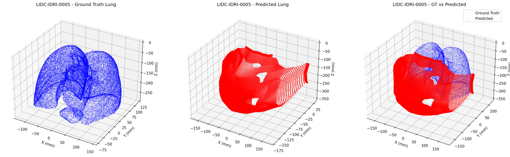

# PanoBEV-3D: 単一DRRからの3D肺野復元

本プロジェクトは、単一のDRR（デジタル再構成放射線画像）から、鳥瞰図（BEV）セグメンテーションと深度推定を経由して、高精度な3D肺野形状を復元する深層学習システムです。

## 🎯 最終成果

- **BEV精度**: Dice係数 0.94（肺野セグメンテーション）
- **3D復元**: 38,000点の高密度点群による肺野形状復元
- **視覚的精度**: GT CTとの3D比較で極めて高い一致性を確認



---

## 📚 開発履歴と技術的知見

### Phase 1: 結節検出アプローチ（失敗例）
**期間**: 初期～中期  
**アプローチ**: 肺結節の2Dセグメンテーション→BEV投影  
**結果**: Dice 0.007 で学習困難

**失敗要因**:
- 極端なクラス不均衡（陽性0.01%）
- スパースターゲットによる学習不安定
- 複雑な損失設計（Focal+Tversky+重み付け）が効果薄

**技術的試行錯誤**:
```python
# 試行した手法（効果薄だった例）
- pos_weight: 200まで増加
- FocalLoss(alpha=0.99, gamma=2.0)
- TverskyLoss(alpha=0.7, beta=0.3) 
- WeightedRandomSampler(非空:空=10:1)
- 膨張ターゲット(max_pool2d)
- ソフトDice補助損失
```

### Phase 2: 肺野全体アプローチ（成功）
**期間**: 後期  
**アプローチ**: 肺野全体の密なセグメンテーション→BEV投影  
**結果**: Dice 0.94 で大成功

**成功要因**:
- **密なターゲット**: 画像の20-30%が陽性
- **シンプルな損失**: MSE+勾配+軽いソフトDice
- **WeightedSampler不要**: データ自体がバランス良い

---

## 🏗️ システム構成

### データパイプライン


